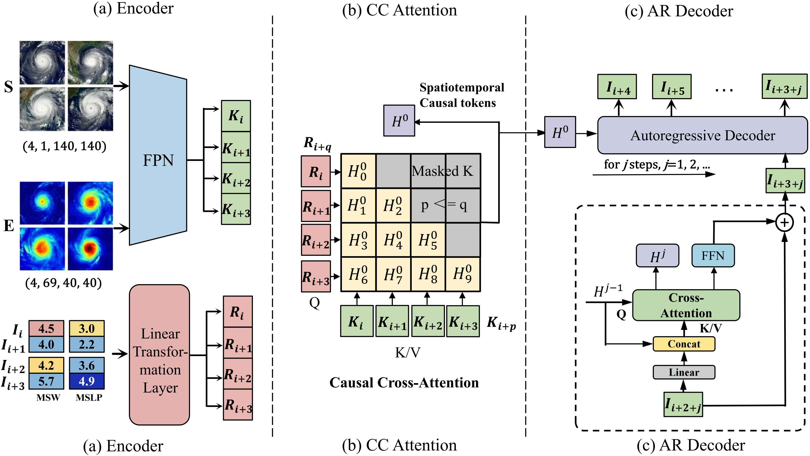

## [IEEE JSTARS 2026] MSCAR: Learning Spatiotemporal Dependencies for Tropical Cyclone Intensity Forecasting with Multi-Source Data

> **Authors:** Lei Liu, Xinyu Wang, Hongwei Zhao, Kang Chen, Xiaoning Yu, Tao Han, Bin Li, Lei Bai.

## 1. Abstract

Accurate prediction of tropical cyclone (TC) intensity is essential for effective disaster mitigation. Existing methods mainly rely on limited spatiotemporal information from ERA5 and overlook the spatiotemporal dependencies between historical intensity sequences and spatial environmental features, which restricts their ability to capture the full spatial and temporal patterns needed for intensity forecasting. To address these limitations, we propose the Multi-modal Multi-Scale Constrained AutoRegressive (MSCAR) model, the first approach to combine spatiotemporal dependency modeling with large-scale multi-modal datasets for autoregressive prediction of global TC intensity. In addition, to fill the gap of a comprehensive dataset covering diverse spatial variables, we introduce the Satellite and ERA5-based Tropical Cyclone Dataset (SETCD), currently the longest and most complete global dataset for TCs. Experiments show that MSCAR outperforms existing methods, reducing forecast errors globally and regionally by up to 9.52% and 6.74%, respectively.

<p align="center">
  
</p>

**Figure 1.** Overall architecture of MSCAR for forecasting TC intensity *j* steps ahead based on the previous four time steps. (a) Encoder: Heterogeneous spatial data are processed and fused by the FPN to generate spatial tokens, while historical intensity data is transformed into intensity tokens via a linear layer. (b) CC Attention: Intensity tokens serve as Queries attending to spatial tokens as Key/Value pairs under a temporal constraint, producing the initial hidden state. (c) AR Decoder: The state is used to autoregressively predict future intensities.

## 2. Requirements

```bash
torch>=2.0.0
torchvision>=0.15.0
numpy>=1.21.0
pandas>=1.3.0
scipy>=1.8.0
einops>=0.6.0
pyyaml>=6.0
tensorboard>=2.10.0
```

## 3. Dataset

We introduce the Satellite and ERA5-based Tropical Cyclone Dataset (SETCD), a comprehensive global TC dataset for intensity forecasting research.

**Download:** [Baidu Netdisk](https://pan.baidu.com/s/1TH0_-PBMeKWceH0HAv0FzA?pwd=bvwm#list/path=%2F) (Code: bvwm)

### Comparison with Existing Datasets

|                          | **SETCD**                              | Digital Typhoon       | HURSAT          | TCIR            |
|--------------------------|:--------------------------------------:|:---------------------:|:---------------:|:---------------:|
| Temporal coverage        | 1980–2022                              | 1978–2022             | 1978–2015       | 2003–2017       |
| Temporal resolution      | 3 hours                                | 1 hour                | 3 hours         | 3 hours         |
| Spatial coverage         | Global                                 | Western North Pacific | Global          | Global          |
| Spatial resolution       | ~8 km (sat) / ~30 km (ERA5)            | ~5 km                 | ~8 km           | ~8 km           |
| Image coverage (pixels)  | 572×572 (sat) / 160×160 (ERA5)         | 512×512               | 301×301         | 201×201         |
| Variables                | IR, WV, VIS, **ERA5 (69 vars)**        | IR                    | IR, WV, VIS, NIR| IR, WV, VIS, PMW|
| TCs                      | **4,668**                              | 1,099                 | 3,946           | 1,285           |
| Frames                   | **282,505**                            | 189,364               | 237,516         | 70,501          |

### Additional Data Sources

- **IBTrACS:** International Best Track Archive for Climate Stewardship. [Link](https://www.ncei.noaa.gov/products/international-best-track-archive)
- **ERA5:** The fifth-generation ECMWF reanalysis. [Link](https://www.ecmwf.int/en/forecasts/dataset/ecmwf-reanalysis-v5)
- **GridSat-B1:** NOAA geostationary satellite data. [Link](https://www.ncei.noaa.gov/products/gridded-geostationary-brightness-temperature)

## 4. Usage

Configure data paths in `configs/default.yaml`:

```yaml
data:
  data_dir: "/path/to/TC_ERA5"
  ibtracs_path: "/path/to/ibtracs.ALL.list.v04r00.csv"
```

Training:

```bash
# Single GPU
python train.py --config configs/default.yaml

# Multi-GPU
torchrun --nproc_per_node=4 train.py --config configs/default.yaml
```

Evaluation:

```bash
python test.py --checkpoint outputs/best.pth \
               --data_dir /path/to/TC_ERA5 \
               --ibtracs_path /path/to/ibtracs.ALL.list.v04r00.csv
```

## 5. Results

<p align="center">
  
</p>

**Figure 2.** Visual comparison of TC intensity forecasts for LANE (SID: 2018226N11245). "GT" represents ground truth, "6h PRE" denotes the 6-hour forecast, and "12~24h PRE" denotes forecasts at 12, 18, and 24 hours. TC LANE exhibits a distinct RI phase in its early stage followed by complex oscillations, serving as a challenging test case for model robustness.

<p align="center">
  
</p>

**Figure 3.** Visual comparison of TC intensity forecasts for HAISHEN (SID: 2020244N25146). HAISHEN exhibits a comparatively simple lifecycle, but MSCAR provides precise estimation of the TC's intensity peaks.

## 6. Acknowledgments

We appreciate the following open-sourced repositories for their valuable code base:

- MMSTN (2022): https://github.com/Zjut-MultimediaPlus/MMSTN
- MGTCF (2023): https://github.com/Zjut-MultimediaPlus/MGTCF

## 7. Citation

If you find our work useful in your research, please consider citing:

```bibtex
@article{mscar2026,
  title={Learning Spatiotemporal Dependencies for Tropical Cyclone Intensity Forecasting with Multi-Source Data},
  author={Liu, Lei and Wang, Xinyu and Zhao, Hongwei and Chen, Kang and Yu, Xiaoning and Han, Tao and Li, Bin and Bai, Lei},
  journal={IEEE Journal of Selected Topics in Applied Earth Observations and Remote Sensing},
  year={2026}
}
```

If you have any problems, contact me via liulei13@ustc.edu.cn.
